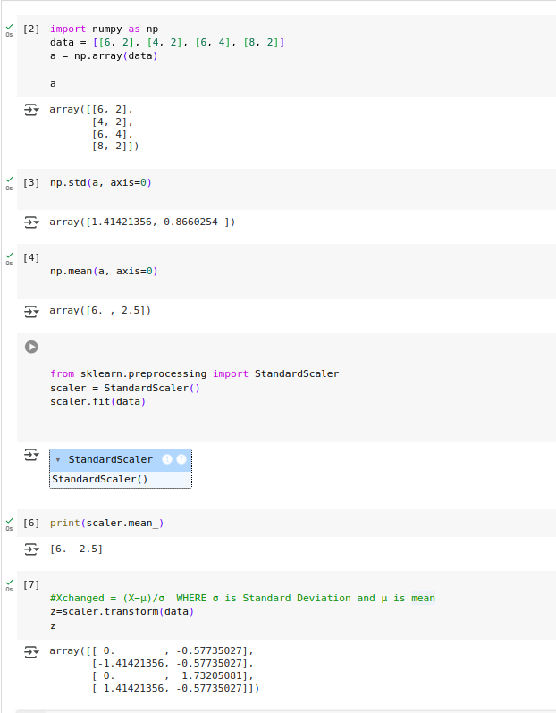
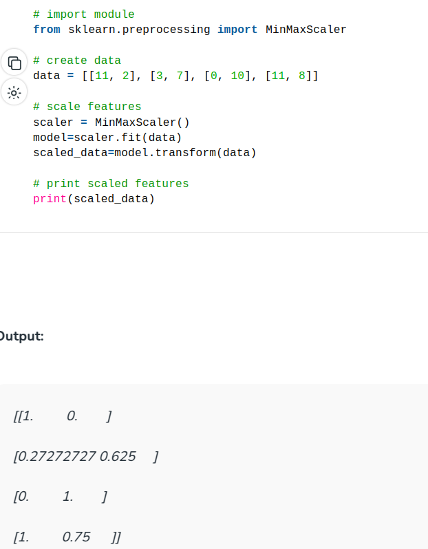

1) What is Standard Scaler?
    - Standard Scaler is a method used for standardizing the features by removing the mean and scaling to unit variance. It is used to transform the data in such a way that it has a mean of 0 and a standard deviation of 1. This is important for algorithms that are sensitive to the scale of the input data, such as SVM, KNN, and neural networks.
    - The formula for standard scaling is:
        - `z = (x - u) / s`
        - where `z` is the standardized value, `x` is the original value, `u` is the mean of the feature, and `s` is the standard deviation of the feature.
    - Standard Scaler is commonly used in preprocessing pipelines to ensure that all features have a similar scale, which can improve the performance of the model.
    - https://www.youtube.com/watch?v=ZMEy9kqG1Ec
- 

2) What is Min-Max Scaler?
    - Min-Max Scaler is a method used for scaling the features to a fixed range, usually between 0 and 1. It transforms the data by subtracting the minimum value and dividing by the range of the data.
    - The formula for Min-Max scaling is:
        - `z = (x - min) / (max - min)`
        - where `z` is the scaled value, `x` is the original value, `min` is the minimum value of the feature, and `max` is the maximum value of the feature.
    - Min-Max Scaler is useful when the data needs to be on a specific scale, such as in image processing or neural networks with specific activation functions.
    - It is important to note that Min-Max Scaler is sensitive to outliers, as it scales the data based on the minimum and maximum values. Outliers can affect the scaling and may need to be handled separately.
    - 

