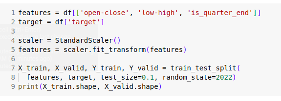
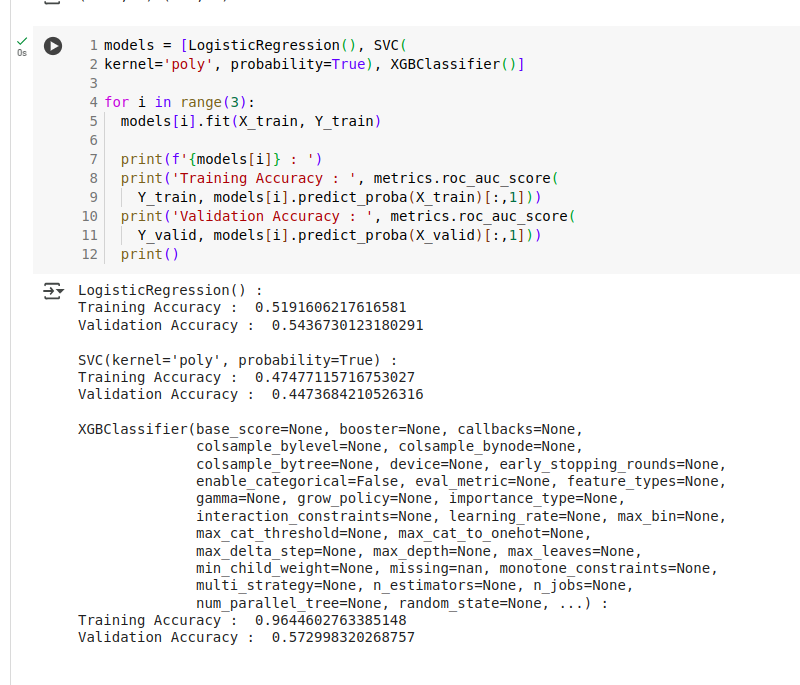
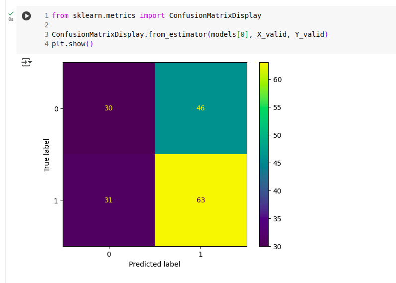

Ref : https://colab.research.google.com/drive/1AB39zmvIAf2NeohljWw_9fkx13FqpclR

1) Try to understand the below code and explain your understanding line for the lines (1,2,4,5,(7,8))

    a) if i give 1000 rows and 10 columns  in data set, what would be the output in line 9?

2)  Try to understand the below code and explain your understanding line by line (5 marks) . 

    a) How many algorithms are used here?

    b) which one gives best output?
    
3) what do you interpret from the below matrix?

    a) how many samples are there in total?

    b) does this include the training data or something else?

    c) give the values for False Positive, True Negative, True Positive and False Negative

